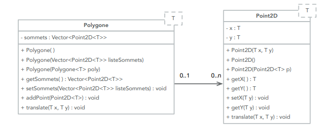
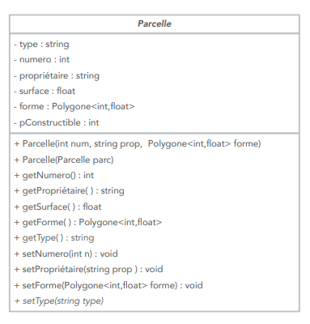
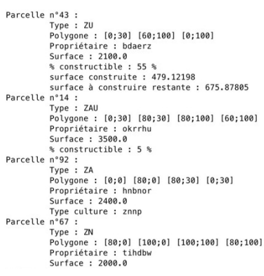
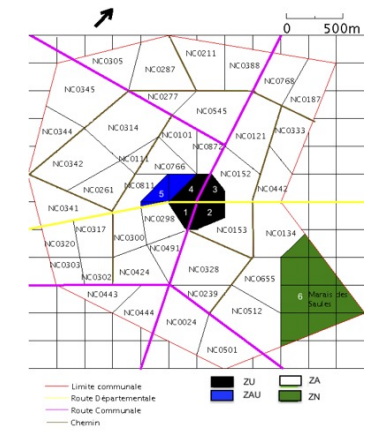

# OOP - Lab4

The aim of this lab is to create a set of classes enabling a community of municipalities to manage a simplified Local Urban Development Plan (PLU) and, more specifically, to implement a new Information System (SI) for managing its land registry adequately, including the new directives of the PLU.

## Class Point2D

This class should represent a point in a two-dimensional Cartesian plane. Figure 1 describes the elements expected in this class. You will overload the << operator to allow the display of a Point2D on the screen.

## Class Polygon

A Polygon is composed of a list of vertices, which are Point2D objects. Figure 1 describes the expected elements in this class. You will overload the << operator to enable the display of a Polygon on the screen.

Figure 1 - Class diagram of the Point2D and Polygon classes

Show through test cases the creation by copy and the translation of a Polygon of your choice. If a polygon is translated, the polygons constructed by copy should not be translated.

## Class Plot

A Plot is characterized by:

- A type (string) that will be defined in the following section.
- A number (integer)
- An owner (string)
- An area in square meters (real)
- A percentage of buildable area of the plot (integer)
- A shape defined by a Polygon<int, float>

Figure 2 describes the expected elements in this class. The Plot class is abstract because it has the setType() method, which is a pure virtual method.
You will overload the << operator to enable the display of plot information on the screen.
For now, let's assume that the shapes of the plots are described by non-intersecting polygons. An exception should be raised if the polygon describing the plot is intersecting, but it is not requested at the moment. However, you must raise exceptions if the area of a plot is negative or zero.
The area of a polygon with integer or real coordinates is calculated from the list of coordinates of the points constituting the vertices of the Polygon in the counterclockwise direction using the formula:

$$
\text{{Area}} = \frac{1}{2} \sum_{i=0}^{n-1} (x_i y_{i+1} - x_{i+1} y_i)
$$

Figure 2 - Class diagram of the Plot class

with ${(x_n, y_n)}_{i=0{^{n-1}}}$ consecutive vertices of the polygon and ${(x_n, y_n)} = (x_0, y_0)$. Thus, during the construction of a Polygon, you will need to calculate the value to assign to the surface attribute. The surface should also be modified if the shape of the Plot changes.

## Types of plots

The PLU (Plan Local d'Urbanisme) does not have only one type of plot and plans to divide the plots in its cadastre according to the following rules:

- Urban Zones (ZU)
- Zones to be Urbanized (ZAU)
- Agricultural Zones (ZA)
- Natural and Forest Zones (ZN)

Additionally, you will create an abstract class "Constructible" with a pure virtual function "surfaceConstructible."

- ZU and ZAU are buildable.
- ZU has an additional characteristic compared to ZAU, as it already has a built surface area (in square meters). For ZU and ZAU, you will write a "surfaceConstructible" method to calculate the buildable area, providing the total buildable area for ZAU and the remaining buildable area for ZU.
- ZA are ZN with additional characteristics of the type of cultivated crop (string). 
- On ZA, a farmer can build agricultural buildings as long as the built area does not exceed 10% of the ZA area and a maximum of 200m2 (fictional numbers).
- ZN are not buildable.

Create a class diagram in your report that considers this new information. Then, implement the new classes ZU, ZAU, ZA, and ZN according to the design of your class diagram. Overload the << operator for ZU, ZAU, ZA, and ZN, specifying the class and adapting the output to write relevant information for each class.

Figure 3 provides an example of the expected screen output for different types of plots.

Figure 3 - Example of screen displays of information about plots of different types.

The names and buildable percentages can be entirely random. Illustrate the implementation of your plots with test cases.

## Map

A Map is characterized by a list of Plots and a total area. A map is constructed based on the information read from a file passed as a parameter, following the following format:
- A Plot is defined by two lines:
  - The first line contains at least: plotType plotNumber owner
  - The second line contains the list of points defining the shape of the Plot
- For ZU: plotType plotNumber owner buildablePercentage builtSurface
- For ZAU: plotType plotNumber owner buildablePercentage
- For ZA: plotType plotNumber owner cropType
- For ZN: plotType plotNumber owner

You will find two examples of backup files in Parcelle_short.txt and Parcelle.txt (Figure 4).

Figure 4 - Map described in the Parcelle.txt file

You must also enable the saving of a Map to a backup file. Complete your previous class diagram with the Map class.